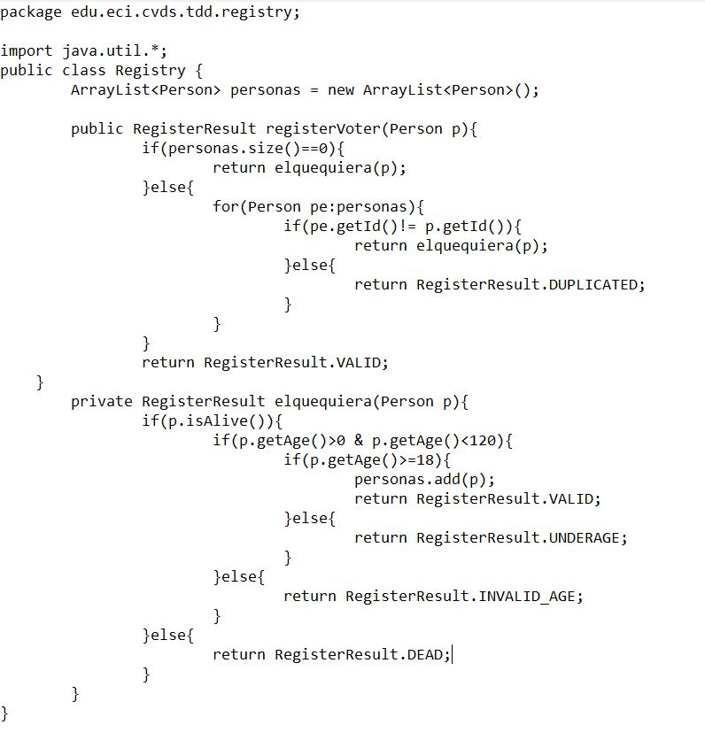
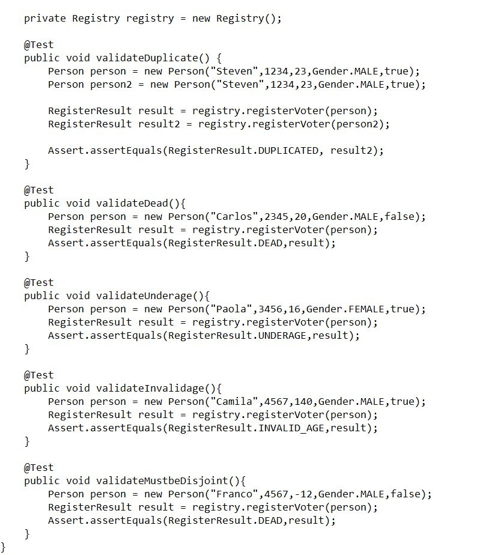
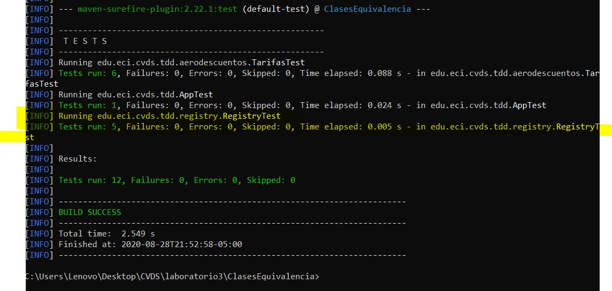
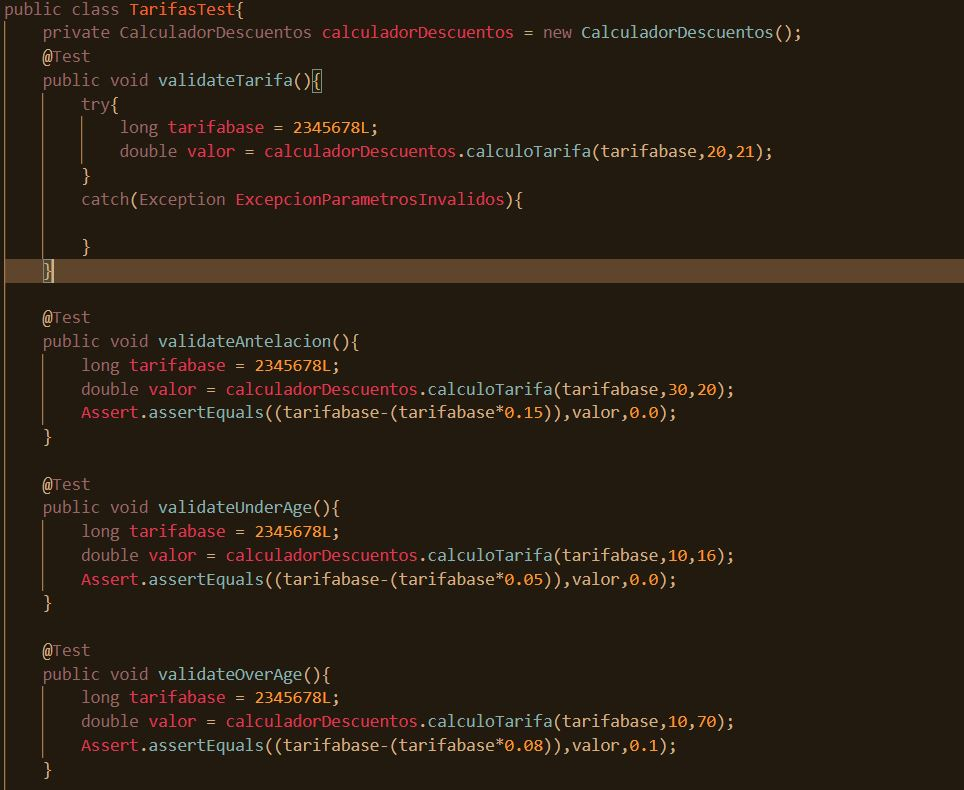

# Clases de equivalencia

* Completando la implementación del método **registerVoter** en la clase **Registry.java** para retornar el resultado esperado segun la entrada. *

* Completando la implementación de la clase **RegistryTest.java** *

## Resultados de las pruebas implementadas en RegistryTest.java 

## Pruebas desde el método cálculo tarifa de la clase CalculadorDescuentos

Validando la información de las entradas y que se cumplieran las condiciones para los descuentos

